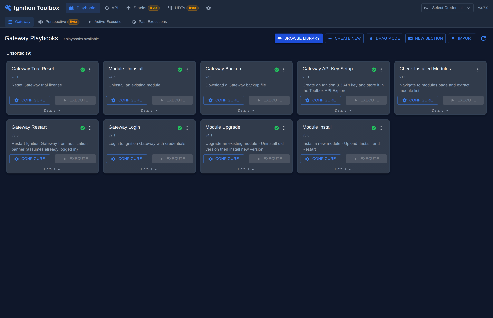
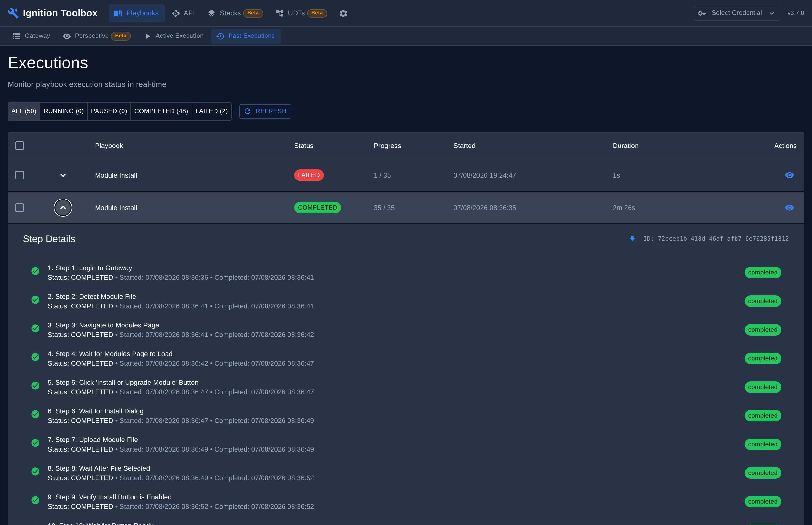
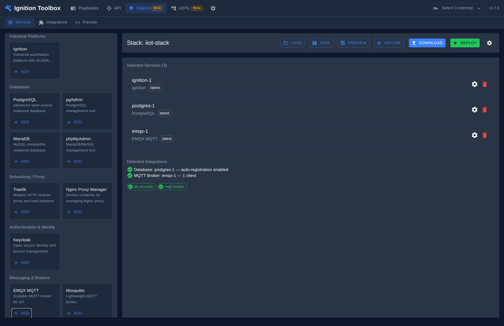
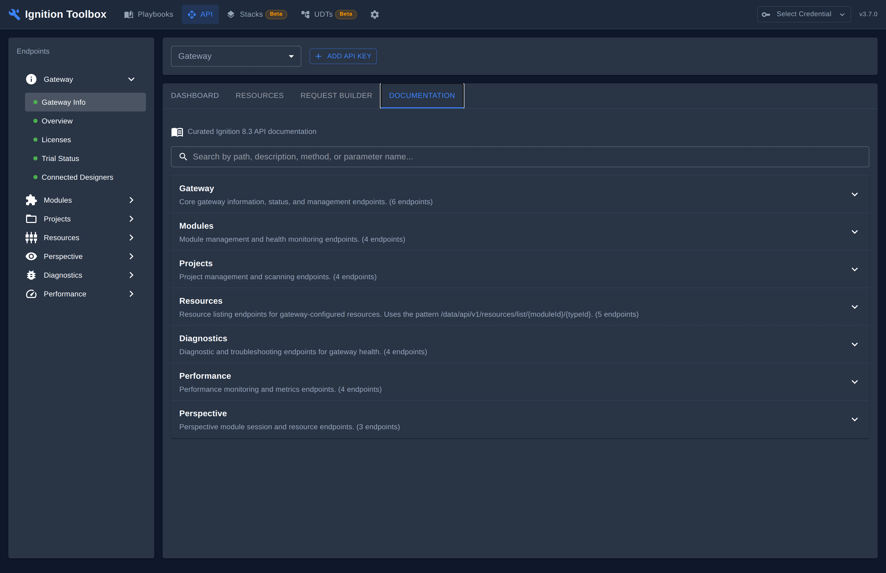
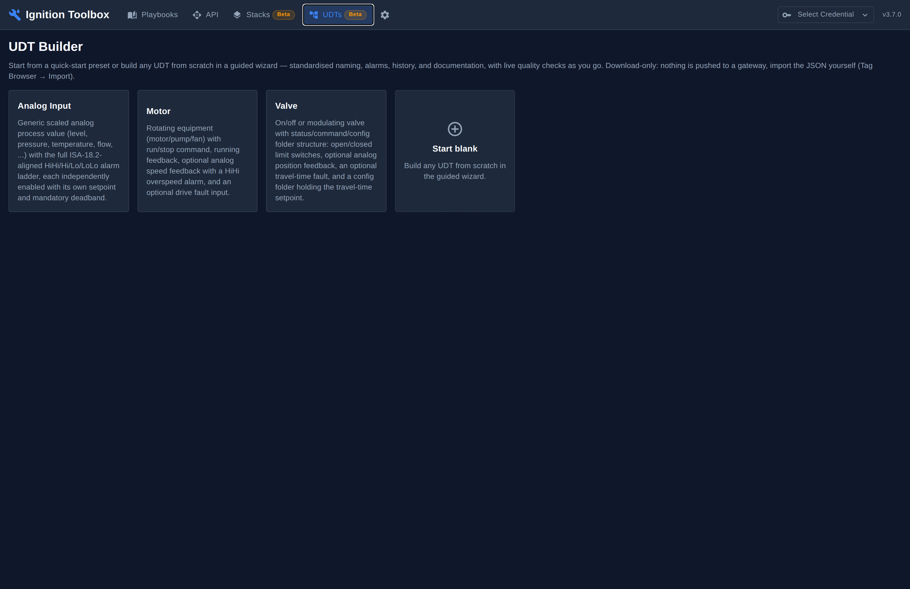

# Ignition Toolbox

A desktop app for visual acceptance testing of Ignition SCADA gateways — reusable playbooks, live browser streaming, and full execution history, instead of throwaway scripts.

## Why this exists

Ignition acceptance testing is usually done by hand or with throwaway scripts:
results aren't repeatable, visual UI problems slip past blind scripts, the same
login and navigation flows get rewritten for every job, and the knowledge walks
out the door with whoever wrote them. The Toolbox makes gateway and Perspective
acceptance testing repeatable and visible — a library of reusable,
domain-separated playbooks runs against Gateways and Perspective sessions with
real-time browser streaming, so the tester *sees* what happened, backed by
encrypted credentials and full execution history.

The full problem statement, target users, and decision framework live in
[PROJECT_GOALS.md](PROJECT_GOALS.md).

## What it looks like


The Gateway playbook library. Nine playbooks ship out of the box — login,
restart, module install/upgrade/uninstall, trial reset, backup, API key setup —
each versioned and ready to configure and run against a real gateway.


A completed run, expanded in place. Every step is timestamped and reported
individually — "Navigate to Modules Page", "Upload Module File", "Verify
Install Button is Enabled" — not just a single pass/fail line, so a failure
points straight at the step that caused it.


Stack Builder assembling a Docker Compose deployment. Services are added from
a categorised catalog; adding a database or MQTT broker is auto-detected as an
integration Ignition can use, shown under "Detected Integrations" before you
deploy.


The built-in API Explorer's curated Ignition 8.3 REST API reference, grouped
by area (Gateway, Modules, Projects, Resources, Diagnostics, Performance,
Perspective) — no separate reference tab needed to look up an endpoint.


UDT Builder's quick-start presets — ISA-18.2-aligned alarm ladders for Analog
Input, Motor and Valve types, or a guided wizard for anything else.
Download-only: nothing is pushed to a gateway, you import the JSON yourself.

## What it does

| Page | Description |
| ------ | ------------- |
| **Playbooks** | Browse, duplicate, edit, and run the YAML playbook library (Gateway and Perspective domains, kept separate) |
| **Executions** | Live execution monitoring with pause/resume/skip/cancel, filterable by status |
| **Execution Detail** | Step-by-step results, screenshots, and log output for a run in progress |
| **Credentials** | Fernet-encrypted credential vault for Gateway/Perspective auth — never stored in playbooks |
| **Stack Builder** | Generate Docker Compose deployments for IIoT/SCADA infrastructure from a service catalog |
| **UDT Builder** | Guided wizard or quick-start presets for standardised, alarm-ladder-complete UDTs (download-only) |
| **API Explorer** | Interactive REST API browser plus curated Ignition 8.3 API documentation |
| **Audit** | Upload a Perspective project export and get a findings report (executive summary + markdown download) |
| **Settings** | Application configuration and preferences |

## How to use it

**Prerequisites:** Node.js 22+, Python 3.13+, npm.

```bash
# 1. Install dependencies
npm install
cd frontend && npm install && cd ..
cd backend && python3 -m venv .venv && source .venv/bin/activate \
  && pip install -r requirements.txt && cd ..

# 2. Run it (Electron shell + backend + frontend together)
npm run dev
```

First run: dismiss the welcome dialog, open **Credentials** and add the
gateway (or Perspective session) you're testing against, then open
**Playbooks → Gateway**, pick one (e.g. *Gateway Login*), **Configure** it with
that credential, and **Execute**. Watch it run live under **Active Execution**;
find it again afterwards under **Past Executions**.

For a permanent install rather than a dev checkout, use a packaged build from
[GitHub Releases](../../releases) — it auto-updates in-app.

---

See [ARCHITECTURE.md](ARCHITECTURE.md) for the system design.

## Run Modes

### 1. Electron App (production)

The standard way end-users run the application. Electron spawns the Python
backend as a subprocess and serves the React frontend.

Install from [GitHub Releases](../../releases) or receive auto-update
notifications in-app.

### 2. Plain Development Server

Run the backend and frontend separately for development:

```bash
# Terminal 1 - Python backend
cd backend && source .venv/bin/activate
python run_backend.py          # FastAPI on :5000

# Terminal 2 - React frontend
cd frontend && npm run dev     # Vite on :3000
```

### 3. Docker (optional)

```bash
docker compose up              # Backend + frontend in containers
```

## Documentation

| Document | Description |
| ---------- | ------------- |
| [Developer Guide](docs/DEVELOPER_GUIDE.md) | Setup, development workflow, testing |
| [Architecture](ARCHITECTURE.md) | System design and ADRs |
| [Project Goals](PROJECT_GOALS.md) | Vision and decision framework |
| [API Guide](docs/API_GUIDE.md) | REST and WebSocket API reference |
| [Playbook Syntax](docs/playbook_syntax.md) | YAML playbook reference |
| [Security](SECURITY.md) | Security architecture and best practices |
| [Versioning](docs/VERSIONING_GUIDE.md) | Version scheme and release process |
| [Troubleshooting](docs/TROUBLESHOOTING.md) | Common issues and solutions |

## Status

Production ready and actively maintained — see `package.json` for the current
version. The app's screens meet WCAG 2.1 AA, checked with `a11y.json` /
`scripts/a11y-gate.js`; the one exception is reflow at a 320px viewport,
which doesn't apply to a fixed-minimum-size Electron window (1024×768,
`electron/main.ts`).

This Electron app is being progressively superseded by Ignition-native
successors in a sister repo (the "Toolbox" suite of Perspective projects,
migrated straight into Ignition rather than run alongside it). Several
features here — Stack Builder and UDT Builder among them — have no
replacement yet, so this app remains the day-to-day tool until its
replacements cover the same ground.

## Licence

Apache-2.0. See [LICENSE](LICENSE).
